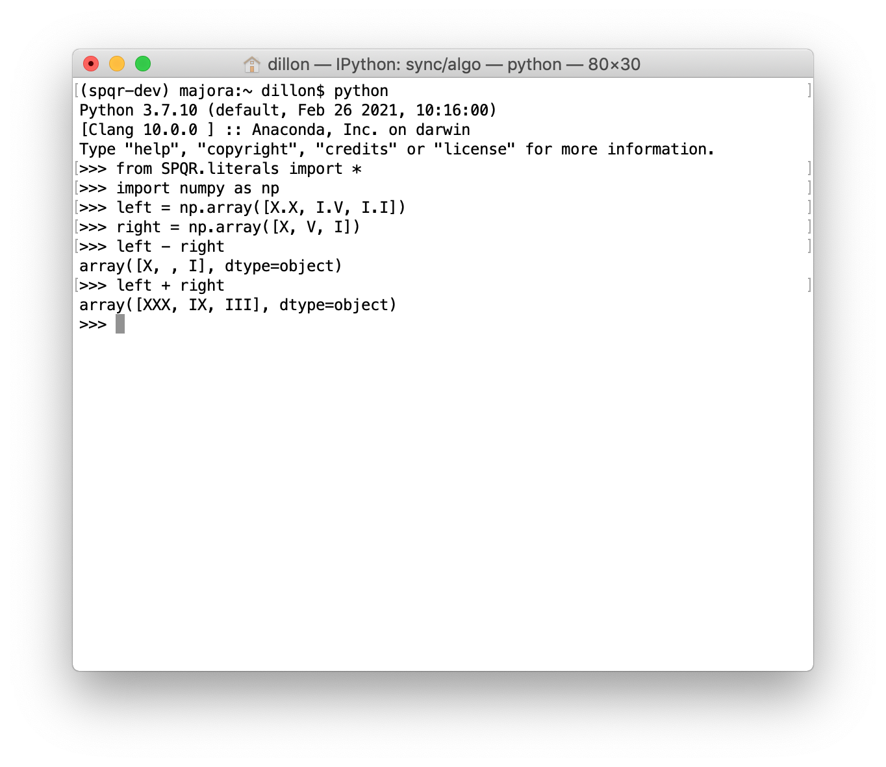

## Roman empire backward compatibility 

**S**till **P**artially **Q**uompatible with **R**oman empire allow you to
deals with numeral use a long time ago in the BF times (BF as Before Fortran).
As you all know the necessity for quick iteration as for long been a goal in
the scientific community, as well a reproducibility and backward compatibility.
Now you can quickly achieve the efficiency you had to engrave number on you
marble tablet calculator from the comfort of your QWERTY keyboard, and
replicate studies made at the time of Neron, Ceasar, and all thoses guy you
don't remember the name.


> Tu quoque mi fili


```python
In [1]: from SPQR import I,V,X,C,M

In [2]: NOW = M.M.X.V # this year

In [3]: AGE = X.X.I.X

In [4]: NOW - AGE
Out[4]: MCMLXXXVI
```

## numpy display format


```python
from SPQR import set_numpy_print_options
set_numpy_print_options()
```

## Praise the gods. 

You can import the unicode caracters 1-12,50 and a few others:

```python
In[5]: from SPQR.literals import *
```

And it of course play nice with the gods. In [**Jupyter**](//jupyter.org) you can tab-completes the above characters with:

```
\roman numeral [one|two|three|...]<tab>
```

It is also usable inside NumPy arrays and other data structures:



### Packaging

Proudly packaged with [flit](https://github.com/pypa/flit)


### logo

Logo from wikimedia commons
